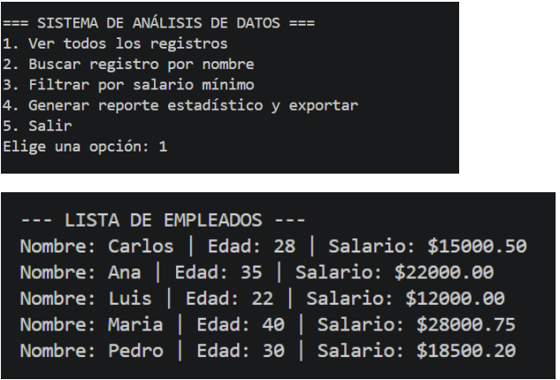
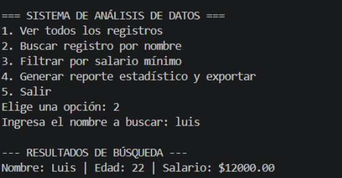
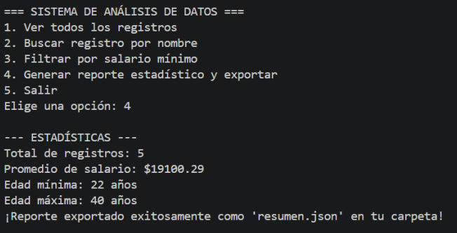
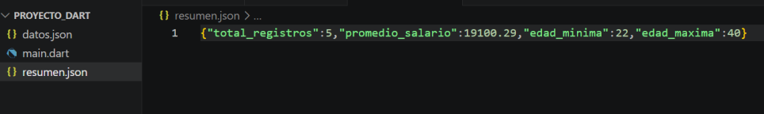

# 📊 Análisis de Datos con Dart

<div align="center">

### Proyecto 2.1 — Portafolio de Proyectos de Desarrollo Móvil

Aplicación de consola desarrollada íntegramente en Dart para la lectura, estructuración, análisis y exportación automatizada de datos a partir de archivos JSON locales.


<br>

💡 Programación Orientada a Objetos  
🛡️ Manejo seguro de nulos (Null Safety)  
🗂️ Lectura y escritura de archivos locales  
⌨️ Menú interactivo en consola

</div>

---

## 📌 1. Nombre del Proyecto

**Análisis de Datos con Dart**

Aplicación de consola (CLI) diseñada para procesar registros de empleados, realizar filtrados dinámicos, generar estadísticas matemáticas y automatizar la creación de reportes en formato JSON.

---

## 🎯 2. Objetivo del Proyecto

El objetivo principal es construir un sistema mediante Dart puro capaz de leer información desde un archivo `.json` local, estructurarla utilizando Programación Orientada a Objetos (POO) y manipularla de forma segura aplicando *Null Safety*. Asimismo, se busca implementar un menú interactivo que permita al usuario realizar búsquedas, aplicar filtros de salario y exportar un reporte automatizado.

---

## 🛠️ 3. Problema que Resuelve

El análisis de datos en crudo suele ser propenso a errores humanos y fallos del sistema por campos vacíos.

Este proyecto automatiza la extracción de datos desde archivos planos, resolviendo el problema de la integridad de la información mediante el uso de *Null Safety* (evitando que el programa colapse si faltan datos o el usuario introduce texto en lugar de números). Además, agiliza la toma de decisiones al procesar los datos en memoria y exportar un resumen estadístico limpio a un nuevo archivo sin depender de software de terceros.

---

## 💻 4. Tecnologías Utilizadas

| Tecnología / Librería | Uso en el Proyecto |
| :--- | :--- |
| **Dart** | Lenguaje principal para la lógica de negocio y ejecución en consola. |
| **`dart:io`** | Librería nativa para la lectura/escritura de archivos (`File`) y captura de datos por teclado (`stdin`). |
| **`dart:convert`** | Librería nativa para la decodificación y codificación de estructuras JSON. |

---

## 🧠 5. Conceptos Aplicados

### 📌 Programación Orientada a Objetos (POO)
Creación de la clase `Registro` y uso de un constructor tipo `factory` (`Registro.fromJson`) para convertir mapas de datos crudos en objetos tipados.

### 📌 Null Safety y Validaciones
Protección del código contra valores nulos usando el operador `??` y validación de entradas del usuario mediante `double.tryParse()` para prevenir cierres abruptos por errores de tipeo.

### 📌 Manipulación de Colecciones
Uso intensivo de funciones de orden superior como `.where()` junto con funciones anónimas para iterar, buscar por nombre (normalizando a minúsculas) y filtrar listas.

### 📌 I/O (Entrada y Salida de Archivos)
Carga de datos locales con `readAsStringSync` y generación/escritura del reporte final utilizando `writeAsStringSync`.

### 📌 Estructuras de Control de Flujo
Construcción del ciclo de vida del programa mediante un ciclo infinito `while` y un bloque `switch` para el manejo del menú interactivo.

---

## ✨ Funcionalidades Implementadas

- ✅ Lectura y parseo de archivos `datos.json`.
- ✅ Búsqueda exacta y parcial de registros por nombre.
- ✅ Filtrado dinámico de empleados por rango salarial.
- ✅ Cálculo de estadísticas (total de empleados, promedio salarial, edades extremas).
- ✅ Exportación automática de resultados a un archivo `resumen.json`.
- ✅ Menú de navegación interactivo en consola a prueba de errores.

---

## 📸 6. Capturas de Pantalla

<div align="center">

| Carga de Datos y Menú (Evidencia I y IV) | Búsqueda y Filtrado (Evidencia II) |
| :---: | :---: |
|  |  |

| Exportación de Estadísticas (Evidencia III) | Archivo JSON Generado |
| :---: | :---: |
|  |  |

*(Nota: Asegúrate de renombrar tus fotos en la carpeta `capturas` para que coincidan con estos nombres, o cambia los nombres aquí en el código).*

</div>

---

### 1. Clonar el repositorio

```bash
git clone https://github.com/IvanGarcia24/PortafolioMoviles_IvanGarcia.git
```

### 2. Acceder al proyecto

```bash
cd PortafolioMoviles_IvanGarcia/Proyecto_02_Analisis_de_Datos_Con_Dart/codigo/Proyecto Dart
```

### 3. Ejecutar la aplicación

```bash
dart run main.dart
```

💭 8. Reflexión Personal

¿Qué aprendí?
En este proyecto logré entender mucho mejor cómo se conectan los conceptos teóricos de Dart en un entorno real. Comprendí lo sencillo y poderoso que resulta manipular archivos directamente en el sistema operativo usando dart:io sin depender de herramientas externas. Además, comprobé de primera mano el valor del Null Safety para mantener viva la aplicación, validando que el programa no colapsara cuando el usuario introducía letras en lugar de números.

¿Qué fue difícil?
El mayor reto fue comprender la transformación de los datos: tomar el texto plano del archivo JSON, decodificarlo a una estructura de tipo Mapa y, finalmente, usar el factory para instanciar la lista de objetos Registro. También requirió especial cuidado la lógica matemática para recorrer la lista y encontrar los extremos (la edad máxima y mínima) sin que el programa fallara.

¿Qué mejoraría?
En el futuro, me gustaría implementar funciones analíticas más complejas (como ordenar la lista de empleados por diferentes criterios usando .sort()), y escalar esta lógica de negocio construyéndole una interfaz gráfica en Flutter para que deje de ser solo una aplicación de terminal.

💻 Proyecto desarrollado íntegramente en Dart puro
Portafolio de Desarrollo Móvil