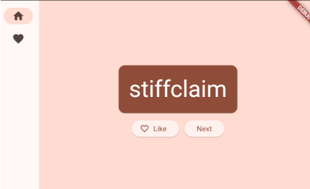
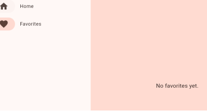

# ✨ Generador de Nombres Aleatorios

<div align="center">

### Proyecto 2 — Primera Aplicación en Flutter

Aplicación desarrollada con Flutter que genera combinaciones aleatorias de palabras y permite almacenarlas en una lista de favoritos mediante gestión de estado global.


<br>

💡 Generación de nombres aleatorios
❤️ Sistema de favoritos dinámico
📱 Interfaz responsiva con NavigationRail
⚡ Gestión de estado global mediante Provider

</div>

---

## 📌 1. Nombre del Proyecto

**Generador de Nombres Aleatorios**

Aplicación móvil desarrollada como introducción al ecosistema Flutter, enfocada en la generación de combinaciones aleatorias de palabras y la gestión de favoritos mediante un sistema de estado compartido.

---

## 🎯 2. Objetivo del Proyecto

El objetivo principal de esta práctica es comprender los fundamentos del desarrollo móvil con Flutter y Dart mediante la creación de una aplicación interactiva.

A través del proyecto se busca aprender la estructura básica de una aplicación Flutter, la construcción de interfaces utilizando widgets, la navegación entre pantallas y la implementación de un sistema de gestión de estado que permita compartir información entre diferentes componentes.

---

## 🛠️ 3. Problema que Resuelve

Muchas aplicaciones necesitan compartir información entre distintas pantallas sin perder consistencia ni duplicar datos.

Este proyecto implementa una solución mediante Provider, permitiendo almacenar nombres favoritos y mantener la sincronización automática entre las diferentes vistas de la aplicación.

---

## 💻 4. Tecnologías Utilizadas

| Tecnología               | Uso                                  |
| ------------------------ | ------------------------------------ |
| Flutter                  | Desarrollo de la interfaz de usuario |
| Dart                     | Lenguaje principal de programación   |
| Provider                 | Gestión de estado global             |
| english_words            | Generación de palabras aleatorias    |
| Material Design          | Componentes visuales de la interfaz  |
| Android Studio / VS Code | Desarrollo y pruebas                 |

---

## 🧠 5. Conceptos Aplicados

### 📌 Gestión de Estado

Implementación de Provider y ChangeNotifier para compartir datos entre diferentes widgets de la aplicación.

### 📌 Widgets Stateless y Stateful

Uso de distintos tipos de widgets según la necesidad de almacenar o no información dinámica.

### 📌 Navegación

Implementación de NavigationRail para cambiar entre las diferentes secciones de la aplicación.

### 📌 Diseño Responsivo

Adaptación de la interfaz a diferentes tamaños de pantalla mediante LayoutBuilder.

### 📌 Programación Orientada a Objetos

Aplicación de clases, propiedades y métodos para organizar la lógica de negocio.

### 📌 Componentización

Separación de elementos visuales en widgets reutilizables para mejorar la mantenibilidad del código.

---

## ✨ Funcionalidades Implementadas

* ✅ Generación de nombres aleatorios.
* ✅ Actualización dinámica de contenido.
* ✅ Sistema de favoritos.
* ✅ Navegación entre pantallas.
* ✅ Interfaz adaptable a diferentes resoluciones.
* ✅ Gestión de estado global mediante Provider.
* ✅ Componentes reutilizables.

---

## 📸 6. Capturas de Pantalla

### Generador de Nombres

<div align="center">

</div>

<p align="center">
Pantalla principal donde se generan combinaciones aleatorias de palabras.
</p>

---

### Lista de Favoritos

<div align="center">

</div>

<p align="center">
Pantalla donde se almacenan los nombres marcados como favoritos por el usuario.
</p>

---

### Comparativa General

<div align="center">

| Generador                                          | Favoritos                                          |
| -------------------------------------------------- | -------------------------------------------------- |
|  |  |

</div>

---

## 🚀 7. Instrucciones de Ejecución

### 1. Clonar el repositorio

```bash
git clone https://github.com/IvanGarcia24/PortafolioMoviles_IvanGarcia.git
```

### 2. Acceder al proyecto

```bash
cd Proyecto_02_Aplicacion_En_Flutter/codigo/flutter app
```

### 3. Instalar dependencias

```bash
flutter pub get
```

### 4. Ejecutar la aplicación

```bash
flutter run
```

### 5. Seleccionar dispositivo

Asegurarse de contar con un emulador Android activo o un dispositivo físico conectado.

---

## 📊 Resumen del Proyecto

| Característica     | Valor                |
| ------------------ | -------------------- |
| Framework          | Flutter              |
| Lenguaje           | Dart                 |
| Gestión de Estado  | Provider             |
| Tipo de Aplicación | Generador de nombres |
| Navegación         | NavigationRail       |
| Diseño Responsivo  | Sí                   |
| Estado             | Finalizado           |

---

## 💭 8. Reflexión Personal

### ¿Qué aprendí?

Durante el desarrollo de este proyecto aprendí los fundamentos del desarrollo móvil utilizando Flutter y Dart. Comprendí cómo se construyen interfaces mediante widgets y cómo se organizan los componentes dentro de una aplicación.

Además, aprendí a utilizar Provider para compartir información entre diferentes pantallas y mantener actualizada la interfaz automáticamente cuando los datos cambian.

También reforcé conceptos relacionados con diseño responsivo, navegación y reutilización de componentes.

---

### ¿Qué fue difícil?

Uno de los principales retos fue comprender cómo funciona la gestión de estado en Flutter y la forma en que Provider permite comunicar diferentes partes de la aplicación.

También fue necesario entender cuándo utilizar widgets Stateless o Stateful y cómo Flutter reconstruye la interfaz cuando ocurren cambios en los datos.

---

### ¿Qué mejoraría?

Como mejoras futuras implementaría funcionalidades adicionales como:

* Persistencia de favoritos mediante almacenamiento local.
* Historial de nombres generados.
* Sistema de búsqueda y filtrado.
* Temas claro y oscuro.
* Compartir nombres generados.
* Personalización de palabras utilizadas para las combinaciones.

Estas mejoras permitirían transformar la aplicación en una herramienta más completa y cercana a un producto real.

---

<div align="center">

### 🚀 Proyecto desarrollado con Flutter y Dart

**Portafolio de Desarrollo Móvil**

</div>
